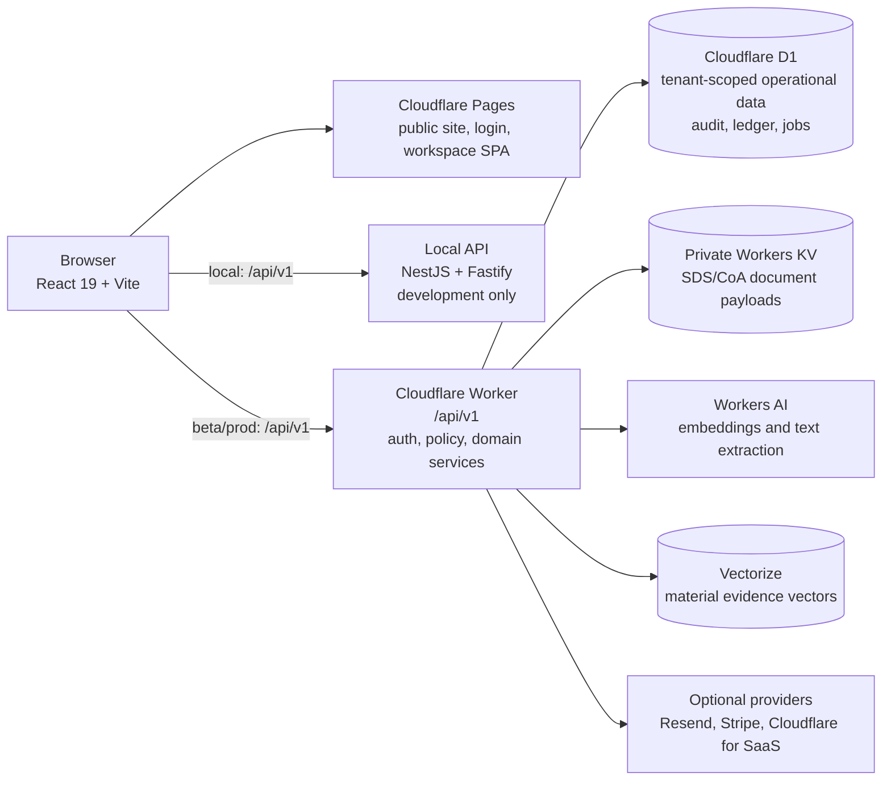
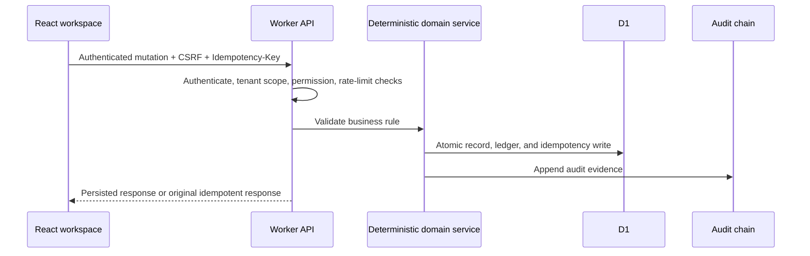
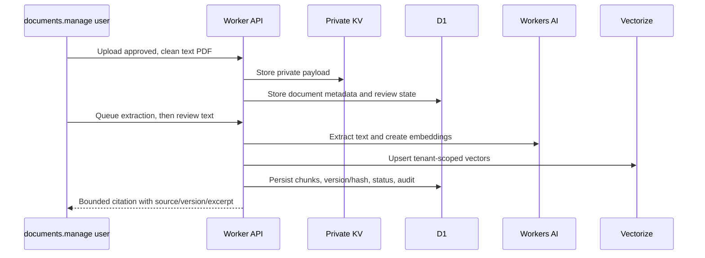
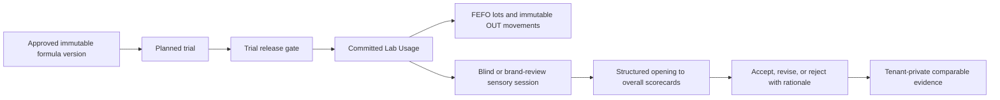

# OlfactoryOps

OlfactoryOps is a multi-tenant operating system for fragrance R&D and commercial operations. It connects material intelligence, formula work, lot inventory, production, procurement, commerce, orders, compliance evidence, and operational analytics in one workspace.

## Stack

- React 19 + Vite frontend
- NestJS/Fastify local API for development
- Cloudflare Workers API + D1 persistence for hosted environments
- Vitest for domain tests and Playwright-based functional harnesses

## System Architecture

OlfactoryOps uses a browser-first React application with two API targets. The local NestJS/Fastify API supports development and deterministic local testing. The hosted Cloudflare Worker is the production and beta API boundary; it owns authentication, authorization, tenant isolation, persistence, audit, and external platform bindings.



### Frontend

- `src/` is the React 19 + TypeScript application built by Vite. It contains the public product site, authentication views, role-aware workspace navigation, Materials, Formulas, Inventory, Production, Commerce, Analytics, and Formula Intelligence workspaces.
- The frontend uses one API client in `src/App.tsx`. It sends browser requests with credentials, adds the CSRF token to mutations, and treats the API as the source of truth for operational records.
- `VITE_API_BASE_URL` selects the API target. It is safe only for public API URLs; any value prefixed with `VITE_` is included in the client bundle and must never contain a secret.
- The frontend is intentionally not trusted to enforce permissions, calculate final compliance, mutate inventory, or persist audit evidence. It presents capability-gated UI, while the server repeats every security decision.

### Motion And Interaction

- Quiet Lab motion lives in `src/ui/motion/` as local, audited React/TypeScript source built on the existing `framer-motion` dependency. No React Bits package, Pro registry, or remote runtime is loaded.
- `AnimatedContent`, `AnimatedList`, `MotionCardButton`, `Stepper`, and `CountUp` make loaded operational data, workflow progress, task choices, and decision cards easier to scan. They are used on the Home task surface, Formula Design Studio, Trials & Sensory, and Production lifecycle gate.
- Motion is intentionally short (160--220 ms), never autoplayed, and never carries required information. It honors both the operating-system `prefers-reduced-motion` setting and the workspace `Reduce motion` preference, which renders the same information without animation.

### Backend

- `server/` contains the NestJS/Fastify API used for local development and test workflows. It binds to `127.0.0.1` and rejects a production/non-loopback configuration.
- `worker/index.ts` is the hosted Cloudflare API. It exposes `/api/v1`, applies request-size limits, CORS, rate limits, opaque-session authentication, CSRF validation, permission checks, tenant scoping, idempotency controls, and audit persistence before or around domain mutations.
- `server/src/services/northstar.service.ts` holds the deterministic domain rules shared by the API targets: formula resolution, IFRA checks, inventory movement, FEFO allocation, production release, costing, approvals, and role permissions.
- Durable background work is implemented in D1 and resumed by the Worker cron. This includes Formula Agent jobs, notification/outbox retries, and Material Evidence indexing jobs. A lease token and bounded retry policy prevent duplicate processing after an interruption.

### Database And Storage

- Cloudflare D1 is the hosted system of record. Every operational record is scoped by `organization_id`; migrations in `migrations/` are applied before the Worker that uses them is deployed.
- D1 stores users, sessions, tenant settings, materials, formulas, formula versions, inventory lots, immutable movement ledger entries, production/receipt/QC records, commercial records, approvals, audit-chain evidence, notifications, idempotency records, agent state, and RAG indexing metadata.
- Private SDS/CoA payloads use the `DOCUMENTS` Workers KV binding during beta. D1 stores document metadata, scan/review status, ownership, versioning, and access evidence. Signed download URLs are not used as a RAG source.
- Material Evidence RAG stores only vector references, bounded excerpts, content hashes, review state, and jobs in D1. Workers AI generates embeddings and Vectorize stores tenant-namespaced vectors. D1 rechecks tenant scope, approval, version, checksum, and permissions after each Vectorize result.

### Supplier Catalogue Import

- The checked-in Lluch Essence Product List 2026 source contains 1,986 supplier product records across synthetic, natural aroma chemical, natural product, and organic product categories. Its source PDF is versioned as `2026-07-16` with SHA-256 `ff6642fcec15f3505470710eca8452fd70d296f9a94a68f074dfe6f9201014a4`.
- Migration `0035_lluch_supplier_catalogue.sql` stores a tenant-scoped import status and product rows in D1. The Worker scheduler imports each active workspace idempotently; an authorized Materials user can also select **Sync catalogue** in Materials to import their workspace immediately.
- The Materials drawer keeps the catalogue in context rather than creating another module. Search by product name or CAS, then select a result to prefill a new-material draft. It never creates a material, supplier approval, lot, purchase offer, or compliance conclusion automatically.
- The catalogue is supplier sourcing evidence, not a specification or regulatory source. It does not supply odor strength, diffusion, tenacity, volatility, IFRA, cost, or compliance decisions. Curated olfactive profiles remain separately versioned and traced in Material provenance.

### Authentication And Authorization

1. A user signs up or signs in through `/api/v1/auth/*`.
2. The Worker creates an opaque, one-way-hashed session credential and sends it in a secure HTTP-only cookie. Browser JavaScript never receives the session secret.
3. `/api/v1/me` restores the authenticated session, workspace context, effective role permissions, and a CSRF token.
4. Cookie-authenticated mutations require `X-CSRF-Token`; sensitive routes have separate rate limits. Non-browser tooling can use an opaque bearer credential where explicitly supported.
5. Each request is authenticated, scoped to its active organization, authorized against the permission matrix, and recorded in audit evidence when it changes controlled state.

Authentication does not grant cross-tenant access. Owner/Admin visibility is still permission-limited: audit evidence is available where appropriate, but private agent payloads, documents, costs, lots, and formula composition remain separately gated.

### Deployment Topology

- **Local development:** Vite serves the browser app at `127.0.0.1:5173`; NestJS/Fastify serves `/api/v1` at `127.0.0.1:4000`.
- **Beta:** Cloudflare Pages serves `test.labofscents.pages.dev`; `olfactoryops-api-test` Worker uses the isolated `olfactoryops-test` D1 database, private test KV namespace, and `olfactoryops-material-evidence-test` Vectorize index.
- **Production:** Cloudflare Pages serves the public/workspace frontend and `olfactoryops-api` Worker uses the production D1 database and production Vectorize index. Production bindings, custom domains, and provider secrets are configured in Cloudflare, never committed to Git or passed to the frontend.
- `wrangler.test.toml` is the explicit test deployment configuration. `wrangler.toml` contains production bindings. Run migrations against the matching D1 database before deploying a Worker.

### Data Flows

**Operational mutation**



**Document evidence and RAG**



**Formula to fulfillment**

```mermaid
flowchart LR
  Draft["Formula draft"] --> Review["Review and approve version"]
  Review --> Batch["Production batch + QC"]
  Batch --> FinishedLot["Released finished-good lot"]
  FinishedLot --> SKU["SKU / catalogue"]
  SKU --> Quote["Quote and multi-SKU order"]
  Quote --> Reserve["FEFO reservation"]
  Reserve --> Fulfill["Fulfillment and COGS"]
  Fulfill --> Ledger["Immutable inventory and audit ledger"]
```



Formula design, simulation, review, and approval do not consume inventory. Inventory changes only when a committed lab usage, receipt, reservation, fulfillment, production consumption, or compensating reversal writes the ledger.

**Trials and sensory memory**



`/trials` is a Workbench workflow for controlled fragrance learning. A trial stores the approved formula-version checksum and release evidence, but it never moves material by itself. Only the existing Lab Usage commit can link actual weights, FEFO allocations, movement IDs, and the lot-cost snapshot to a released trial. Internal `SENSORY_PANELIST` users receive a blinded scorecard. Public links are opaque, hashed, rate-limited, revocable, and disclose either a sample code only or an explicitly approved brand narrative and pyramid. Comparable evidence stays inside its originating tenant and reports `Not enough evidence` until at least three completed scorecards are available.

## What You Need

- Node.js 22 or newer
- npm 10 or newer
- Cloudflare account and Wrangler authentication only for Worker/D1 deployment

## Quick Start

Install dependencies:

```bash
npm ci
```

Start the local API in one terminal:

```bash
npm run dev:api
```

Start the frontend in a second terminal:

```bash
npm run dev
```

Open `http://127.0.0.1:5173`. The Vite app calls the local API at `http://127.0.0.1:4000/api/v1` by default.

To point the frontend at another API, create an ignored local `.env.local` file:

```bash
VITE_API_BASE_URL=https://your-api-host.example/api/v1
```

Do not put passwords, Cloudflare secrets, or production credentials in a `VITE_` variable. Those values are bundled into browser code.

## Sign In And Sample Data

The development service starts with a seeded administrator account:

- Email: `admin@labofscents.org`
- Password: configure it through the password-hash helper below; no default password is stored in source control.

Create a password verifier interactively:

```bash
npm run security:hash-admin-password
```

For the local Nest API, set the resulting verifier in the same PowerShell session before starting the API:

```powershell
$env:SEEDED_ADMIN_PASSWORD_HASH = 'pbkdf2:v1:sha256:...'
npm run dev:api
```

For Cloudflare, store the generated verifier as `SEEDED_ADMIN_PASSWORD_HASH` using Wrangler. The seeded workspace includes representative materials, lots, formulas, production batches, SKUs, customers, quotes, orders, audit events, and analytics records so the primary flows are usable immediately.

## Useful Commands

```bash
# Build and type-check the frontend
npm run build

# Build the Nest API
npm run build:api

# Run domain tests
npm run test

# Run all deploy-time checks
npm run deploy:check

# Start the Cloudflare Worker against local D1
npm run dev:worker

# Apply D1 migrations locally
npm run d1:migrate:local

# Run functional and Formula live checks (requires credentials in environment variables)
npm run test:functional:report
npm run test:formula:live
```

## Cloudflare Deployment

The hosted architecture is Cloudflare Pages for the frontend and Cloudflare Workers + D1 for the API and data store.

1. Authenticate and create the D1 database.
2. Copy the D1 database ID into `wrangler.toml`.
3. Apply migrations with `npm run d1:migrate:remote`.
4. Store `SEEDED_ADMIN_PASSWORD_HASH` as a Worker secret.
5. Deploy the API with `npm run deploy:worker`.
6. Set the Pages build command to `npm ci && npm run build`, output directory to `dist`, and `VITE_API_BASE_URL` to the deployed API endpoint.

The full production checklist, security requirements, custom domain guidance, and live test commands are in [docs/deployment.md](docs/deployment.md).

### Enterprise Release Gates

- Apply D1 migrations before deploying a Worker. `0025_enterprise_persistence_audit_chain.sql` completes the normalized-state cutover and adds append-only audit-chain evidence. `0026_finished_goods_operational_trace.sql` adds finished-good lots, finished-good ledger/COGS, formula SKU support, and organization scope for commerce records.
- `0027_operational_p1_enterprise.sql` adds tenant-scoped material compliance, approved supplier offers, quarantined receipt/inspection/RMA records, immutable landed-cost allocations, structured QC specifications/results, yield reconciliation, and operation idempotency records. Apply it before a Worker that exposes the Operational P1 routes.
- `0028_auth_session_credentials.sql` replaces legacy session-ID credentials with opaque, one-way-hashed Worker credentials and revokes pre-migration sessions. Users must sign in again after it is applied.
- `0033_material_evidence_rag.sql` adds tenant-scoped reviewed evidence sources, bounded citation chunks, and lease-fenced indexing jobs. Before deploying it, create separate 768-dimension cosine Vectorize indexes for test and production, add the `AI` and `RAG_INDEX` bindings from the matching Wrangler configuration, and create metadata indexes for `organizationId`, `status`, `materialId`, `documentId`, `sourceKind`, and `indexVersion`.
- `0035_lluch_supplier_catalogue.sql` imports the 1,986-row Lluch Essence Product List into tenant-scoped D1 supplier-catalogue tables. Apply it before deploying the Worker; the first scheduled run or an authorized **Sync catalogue** request performs the idempotent per-workspace import.
- A production batch can create a finished-good lot only after approved formula input, raw-material consumption, QC pass, and release. Formula SKUs reserve released finished-good lots using FEFO and write COGS only when fulfilled.
- `GET /api/v1/audit/chain/verify` and `GET /api/v1/audit/chain/evidence` are Owner/Admin-only evidence endpoints. They never return provider secrets.
- Beta integrations are honest by default: integration readiness returns `Not configured` until its Worker secret and any DNS/HTTPS dependency are active. `managed_beta` continues to reject all Stripe customer-payment mutations server-side.

For the isolated beta Worker, use the test configuration explicitly:

```bash
npx wrangler d1 migrations apply olfactoryops-test --remote --config wrangler.test.toml
npm run deploy:worker -- --config wrangler.test.toml
npm run deploy:pages:test
```

Do not deploy the Worker until the remote D1 migration succeeds. `beta.labofscents.org` remains an external DNS/Pages custom-domain gate; a successful Pages preview is not evidence that the hostname resolves or has a valid certificate.

### Operational P1 Workflow

1. An Owner or Admin records a material compliance profile with an IFRA category limit, EU/UK flags, source, version, review date, and disposition. `BLOCKED` materials cannot be purchased or consumed. `REVIEW_REQUIRED` material can only enter receiving quarantine.
2. A sent purchase order creates a goods receipt. Each receipt line becomes a `QUARANTINE` lot and a `RECEIPT` ledger movement; it is not FEFO-eligible or production-eligible.
3. Post freight, duty, and insurance before accepting the receipt. The service allocates the total by extended line value, sends any rounding residual to the highest-value line, and stores immutable landed unit cost on the lot.
4. An Owner, Admin, Lab Manager, or Manager inspects the receipt. Acceptance promotes the lot to available inventory; return-to-supplier writes an immutable return movement. Open discrepancies block acceptance.
5. Create a formula-specific release QC template before starting a P1 batch. Operators record structured results; an Admin or Manager approves QC without MFA. Reconcile yield, waste, labor, and overhead before release. Release then creates a private Batch CoA record in review state and an auditable finished-good lot.

The P1 routes require `Idempotency-Key` on mutations in the Worker. Retrying the same request returns the persisted response instead of repeating a receipt, landed-cost posting, QC approval, yield record, or lifecycle mutation.

## Data And Security Notes

- Tenant access, sessions, permissions, and audit events are server-enforced.
- Worker cookies carry an opaque session credential, never the displayed audit session ID. Mutating cookie-authenticated API calls require a CSRF token; opaque bearer credentials remain available only for non-browser tooling.
- The local Nest/Fastify API is development/test-only and binds to `127.0.0.1` by default. It refuses production runtime and non-loopback `HOST` values.
- D1 stores structured operational metadata; beta SDS/CoA binaries live in a private Cloudflare Workers KV namespace, while document metadata and signed-access evidence remain in D1.
- Material Evidence RAG is evidence-first: only approved, clean documents and reviewed text-bearing PDFs are indexed. A missing Workers AI or Vectorize binding returns `Not configured`; it never returns generated evidence. Setup and access rules are documented in [docs/material-evidence-rag.md](docs/material-evidence-rag.md).
- Generated functional reports, browser evidence, `.env*` files, and credentials are intentionally ignored by Git.

## Production Integrations

The application keeps provider secrets in the Cloudflare Worker only. No `STRIPE_*`, `RESEND_*`, `CLOUDFLARE_*`, password, or provider token may use a `VITE_` prefix.

- **Managed beta billing**: `BILLING_MODE=managed_beta` is the default. It removes plan and invoice data from the customer UI and rejects checkout, portal, plan-change, and Stripe webhook requests server-side. Switch to `self_service` only after Stripe credentials, price IDs, and webhook validation are configured.
- **Transactional email**: the in-app notification outbox is persisted in D1 and delivers invite, new-device security, billing, and privacy-request messages through Resend when `RESEND_API_KEY` and `EMAIL_FROM` are configured. Failures retry with a bounded backoff and never roll back a business mutation.
- **Cloudflare for SaaS**: an Owner or Admin can provision and refresh a customer-owned hostname only after Cloudflare API token, SaaS zone ID, and optional custom origin are configured. The workspace hostname changes only after Cloudflare reports both hostname and SSL activation; DCV and provider errors remain visible while pending.
- **Imports**: Material Library accepts CSV and XLSX for both materials and inventory lots, lets the user map columns, performs a dry-run with row-level errors, and commits only a validated, idempotent job. A lot can match its material by ID, CAS, or name.
- **PWA and QR**: production builds register a privacy-safe app-shell service worker. API responses are never cached. Inventory can scan an OlfactoryOps lot QR through the browser camera and only selects the matching current-workspace lot.
- **Notification and legal operations**: the member inbox supports invitation, security, billing, low-stock and expiry events. Password-reset tokens are one-time and hashed in persistence; legal consent is versioned; a member can download a scoped JSON personal-data export or request erasure review.
- **Observability and language**: `GET /api/v1/status` reports D1 and recent slow/error event counts. Optional Sentry receives only route, status, and duration for Worker 5xx errors. The tenant locale supports English and Vietnamese in the shared shell, navigation, authentication, and notification surfaces while technical fragrance data remains language-neutral.

The public status page is available at `/status.html` on the test Pages, Vercel beta, or production frontend host. It polls only the public health endpoint and does not reveal workspace data.

## Project Layout

```text
src/                    React application and domain models
server/                 NestJS local development API
worker/                 Cloudflare Worker and D1 persistence adapter
migrations/             D1 schema migrations
scripts/                security, functional test, and utility scripts
docs/                   deployment and product documentation
```

## Before A Pull Request Or Deployment

```bash
npm run build
npm run build:api
npm run test
npm run security:client-bundle
```

For a Cloudflare release, use `npm run deploy:check` after the database migrations and Worker secrets are in place.
