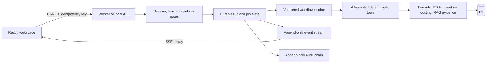

# Agent Platform: Target Architecture

## Design objective

The server is the source of truth. The browser renders only typed, persisted, permission-projected artifacts and uses SSE solely as an event transport.

## Required invariants

- Protocol version is explicit and additive. Unknown event types are ignored by clients, while invalid envelopes never mutate browser state.
- Workflow definitions are fixed, versioned, and validated before execution.
- Every write is tenant-scoped, authorization-checked, idempotent where it can have a side effect, and audited.
- A job lease token fences every worker execution write. A stale executor cannot append events, create artifacts, or complete a run.
- Browser replays from `Last-Event-ID` or `afterSequence`; a sequence conflict or a bounded-buffer overflow triggers an authoritative re-sync.
- Model output cannot execute code, SQL, URLs, or arbitrary tools. Tool inputs, outputs, excerpts, timeouts, and retry policy are bounded.

## Provider posture

Mock mode is the default and the only enabled provider for this release. A future provider adapter may call typed function tools, but it must persist only minimal encrypted continuation context, never hidden reasoning, raw request headers, provider secrets, or raw provider error payloads.
