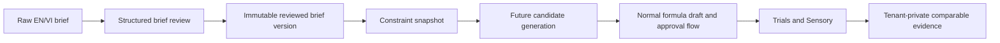

# Competitive Moat: Target Architecture

The Competitive Moat builds a private fragrance-learning loop on the existing
Formula Intelligence architecture. The system of record remains deterministic
services and tenant-scoped persistence; a future model may assist with
language interpretation but never becomes a source of truth.

## Authority Boundaries

- The authenticated server session supplies organization and actor identity.
- The Formula Intelligence store validates project ownership, brand
  membership, existing Formula permissions, and idempotency before every
  mutation.
- Brief text is untrusted data. It cannot select a tenant, invoke a tool,
  issue SQL, request a URL, or bypass policy.
- Formula math, IFRA, compliance, cost, inventory, FEFO, approval, and stock
  movement remain existing deterministic workflows.
- A future LLM may propose a structured representation, but the user must
  review it and a server-side schema/business validator must accept it before
  it becomes a generation input.

## Phase 0-2 Data Mapping

`formula_design_projects` stays the aggregate root. New immutable brief
versions are linked by `current_brief_version_id`; existing runs retain their
existing configuration and future Design Studio runs gain a generation-context
row. Existing `formula_design_directions` remain candidate records; no
parallel project or candidate hierarchy is introduced.
