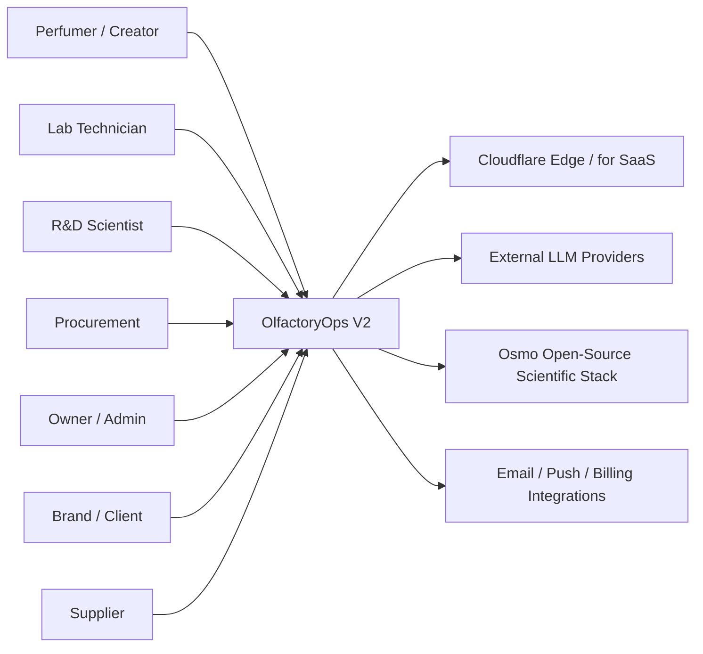
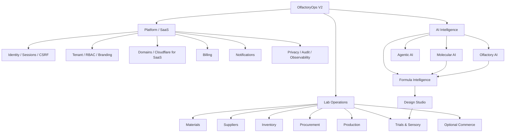
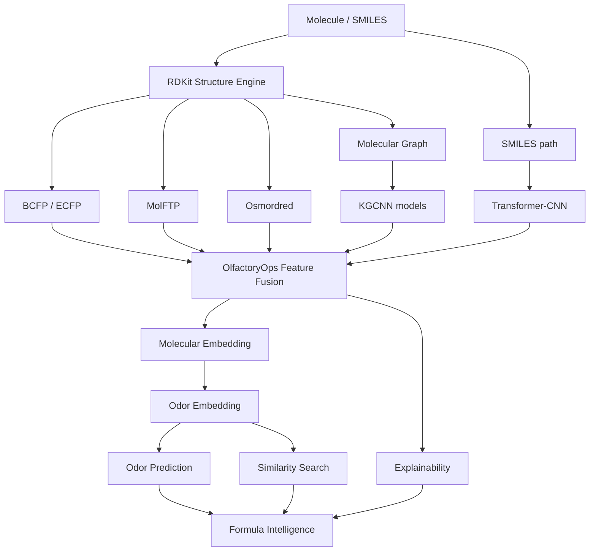
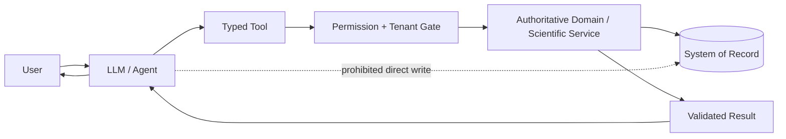
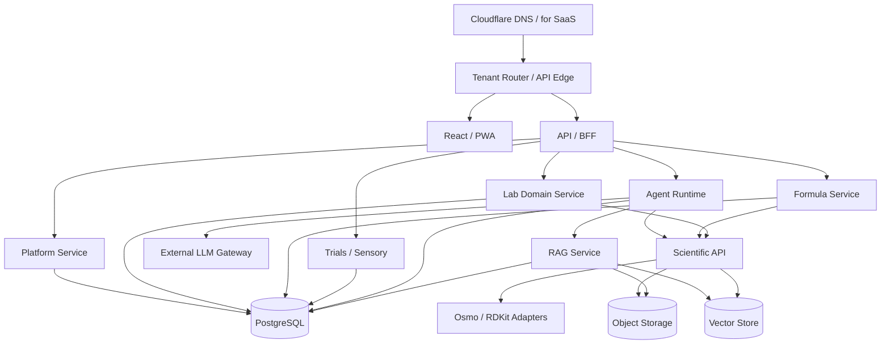
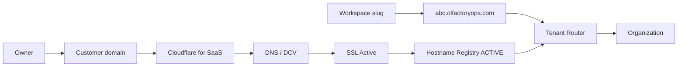
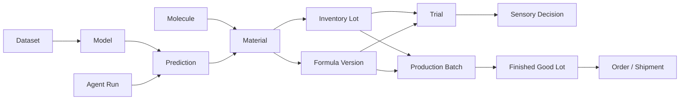
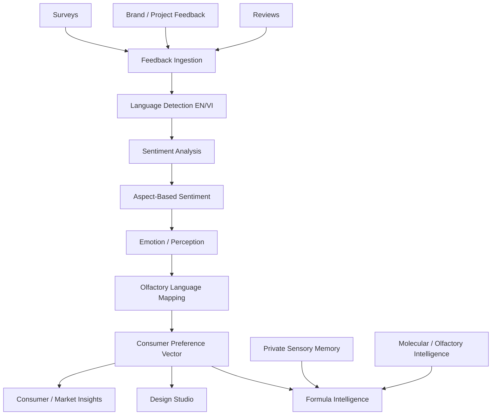

# OlfactoryOps V2 — Architecture

## 1. System context

## 2. Module map

## 3. Scientific Core — Osmo-based

## 4. Authority boundary

## 5. Service topology

## 6. Design Studio intelligence loop

```mermaid
flowchart LR
  B[Raw Brief] --> L[LLM Structured Proposal]
  L --> R[Human Review]
  R --> C[Validated Constraints]
  C --> M[Material Universe Snapshot]
  M --> S[Scientific + RAG Evaluation]
  S --> D[Candidate Directions]
  D --> P[Perfumer Review]
  P --> F[Formula Draft]
  F --> A[Formula Approval]
  A --> T[Trial]
  T --> SE[Sensory Evidence]
  SE --> MEM[Private Sensory Memory]
  MEM -. bounded ranking signal .-> S
```

## 7. Workspace domain model

## 8. Operational trace

## 9. Sentiment & Consumer Intelligence

