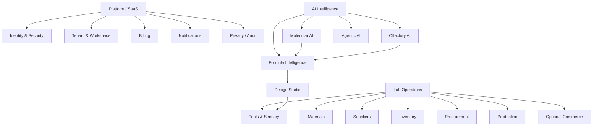
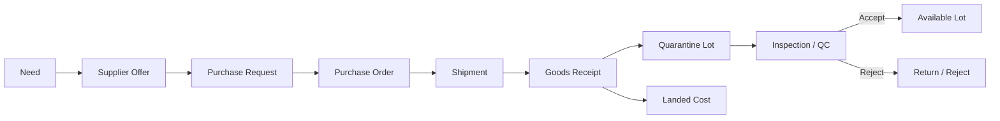

# BRD — Business Requirements Document
## OlfactoryOps V2

## 1. Purpose

This BRD defines how the business requirements are realized as modules, actor workflows, state transitions, business rules and acceptance criteria. It bridges the BRS and SRS.

## 2. Capability map



## 3. Role model

Default roles are templates; actual access is permission-driven.

| Role | Typical authority |
|---|---|
| Owner | governance, billing, domain, audit, privacy/export, observability |
| Admin | membership, roles, settings, operations |
| Lab Manager | material/inventory/procurement/production/trials |
| Perfumer | Formula/Design/Trial/scientific tools |
| R&D Scientist | scientific models, datasets, research evidence |
| Lab Technician | receiving, weighing, execution, QC data entry |
| Procurement | suppliers, offers, PO, receiving |
| Sensory Panelist | blind sensory evaluation |
| Brand/Client | brief + explicitly shared safe views |
| Supplier | commercial/catalogue/quote/order if enabled |
| Finance | costing/billing according to permission |
| Read-only | authorized read projection |

## 4. Workspace lifecycle

### 4.1 Signup/provisioning

1. User submits organization name, workspace slug and identity credentials.
2. Server normalizes and validates slug.
3. Organization, Owner membership and default policies are created transactionally.
4. Default hostname `<slug>.olfactoryops.com` is allocated.
5. Email-verification hash record is created.
6. User enters onboarding.
7. Workspace becomes operational after required setup.

### 4.2 Custom domain

1. Owner enters customer-owned hostname.
2. System verifies uniqueness/reserved names.
3. Cloudflare for SaaS custom hostname is created.
4. UI displays DNS/DCV requirements.
5. Provider state is refreshed.
6. Only provider-confirmed hostname + SSL becomes ACTIVE.
7. Tenant router resolves Host -> organization.
8. Default `*.olfactoryops.com` remains recovery path.

## 5. Personal data vs tenant IP

### Personal data examples
- identity/profile
- credential metadata
- sessions/devices
- consent records
- notification preferences
- security events
- memberships
- user-attributable activity where policy requires

### Tenant business/scientific data examples
- materials
- suppliers
- inventory/lots
- Formula IP
- Trials
- production
- orders
- uploaded business documents
- model outputs for tenant projects

**Privacy Export** is user-centered.  
**Workspace Export** is organization-centered and Owner/Admin controlled.

## 6. Material process

Suggested lifecycle:

```text
DRAFT -> REVIEW_REQUIRED -> ACTIVE -> BLOCKED -> ARCHIVED
```

Material includes:
- internal name
- chemical/molecular identity link
- CAS/INCI/synonyms when available
- tenant/global scope
- sensory evidence
- compliance facet
- documents
- supplier offers
- inventory references
- scientific predictions

AI prediction cannot silently overwrite curated identity.

## 7. Supplier process

Supplier Profile includes:
- legal/trade identity
- contacts/locations
- currency/payment terms
- lead time
- certifications/documents
- status
- quality/performance history

Supplier Offer relates:

`Supplier -> Material -> supplier product/grade -> MOQ -> price -> currency -> lead time -> validity`.

## 8. Procurement



Rules:
- receipt does not imply availability
- quarantine is not FEFO eligible
- posted landed cost is immutable except by controlled correction
- supplier quality metrics derive from actual outcomes

## 9. Inventory

### Ledger rule
Stock-changing actions produce immutable movement records.

Quantity dimensions:
- received
- available
- reserved
- consumed
- returned
- wasted
- shipped

### FEFO
Eligibility first:
- same tenant
- correct material
- AVAILABLE
- QC passed
- not expired
- not blocked/quarantined

Then earliest expiry + deterministic tie-break.

## 10. Lab Weighing / Consumption

1. Open Formula/Trial/Production weighing session.
2. Compute required amounts.
3. Propose FEFO-eligible lots.
4. Record actual selected lot and actual weight.
5. Validate tolerance.
6. Confirm.
7. Write immutable consumption movements.
8. Create Formula/Trial/Batch trace link.
9. Correction uses compensating movement.

## 11. Formula V2

Entities:
- Formula Project
- Formula Draft
- Formula Version
- Formula Component
- Formula Review
- Formula Approval
- Formula Provenance

Approved/downstream Formula Version is immutable.

Draft can originate from:
- manual creation
- Design Studio candidate
- previous version
- future Optimizer

## 12. Formula Design Studio V2

1. Creator submits raw brief.
2. External LLM may propose structured intent.
3. Human reviews structured intent.
4. Server validates constraints.
5. Material universe is created from authorized sources:
   - tenant materials
   - future rebuilt Global Materials
   - RAG evidence
   - inventory visibility
   - compliance state
   - molecular similarity/predictions
6. Formula Intelligence produces candidate directions.
7. Deterministic systems validate math/evidence.
8. Perfumer compares candidate/explanation.
9. Perfumer explicitly saves Formula Draft.
10. Normal review/approval follows.

Brand projection is recipient-scoped and redacted.

## 13. Trials & Sensory

Suggested Trial lifecycle:

```text
PLANNED
-> RELEASED_FOR_TRIAL
-> WEIGHING
-> MIXED
-> CONDITIONING
-> EVALUATING
-> DECIDED
-> CLOSED
```

Terminal:
- CANCELLED

Sensory:
- blind/sample code
- evaluator assignment
- timepoints
- structured scorecards
- comments according to privacy
- decision

Private Sensory Memory:
- only from decided/sufficient evidence
- tenant-private
- versioned
- no rewrite of raw evidence
- bounded use for ranking/recommendation
- not a guaranteed sensory prediction

## 14. Production V2


Traceability retains:
- Formula Version
- planned/actual usage
- raw lot IDs
- yield/waste
- process timestamps
- QC evidence
- release actor/time
- output lot
- downstream order/shipment

## 15. Commerce/Fulfillment

Commerce is enabled per workspace.

Sequence:

`Catalogue/SKU -> Quote -> Sales Order -> Reserve -> Pick -> Pack -> Ship -> Fulfill`.

Reservation is not shipment.

Supplier tenants may expose commercial catalogue without exposing private R&D.

## 16. Agentic AI behavior

Agent can:
- interpret brief
- search material evidence
- request molecular prediction
- compare candidates
- summarize Trial evidence
- prepare actions
- orchestrate workflows

Agent cannot independently:
- approve Formula/Material
- release batch/lot
- modify inventory ledger
- change role policy
- fulfill order
- alter billing
- make legal/compliance determination

Mutating actions require registered tool + permission + validation + idempotency + confirmation where required + audit.

## 17. Scientific capability

OlfactoryOps adopts selected Osmo repositories as building blocks.

Representations:
- BCFP/ECFP
- MolFTP
- Osmordred
- GNN
- Transformer-CNN

OlfactoryOps develops:
- feature fusion
- molecular embedding
- odor embedding
- odor prediction
- similarity
- uncertainty/calibration
- explainability composition
- model registry
- provenance

## 18. Operational lineage

Authorized lineage should connect:

```text
Material/Molecule
-> Supplier Offer
-> Inventory Lot
-> Formula Component
-> Formula Version
-> Trial
-> Actual Consumption
-> Sensory Decision
-> Production Batch
-> Finished Good Lot
-> SKU/Order/Shipment
```

AI lineage:
- dataset
- transformation
- model
- prediction
- RAG citation
- agent run/tool call

## 19. Acceptance criteria

### Platform
- cross-tenant tests fail closed
- default domain resolves correct tenant
- custom domain cannot activate early
- Owner can revoke sessions
- Privacy Export and Workspace Export are separate

### Inventory
- stock reconstructable from ledger
- FEFO excludes quarantine/expired
- reversal is compensating movement

### Formula
- approved version immutable
- Design Studio save creates draft only

### Trials
- planning does not move stock
- weighing creates lot evidence
- insufficient evidence is explicit

### AI
- prediction identifies model version
- LLM cannot invoke unknown tool
- external provider failure creates explicit degraded/failure state

### Provenance
- external dataset has source/license/checksum
- model identifies training datasets
- release has third-party notices
