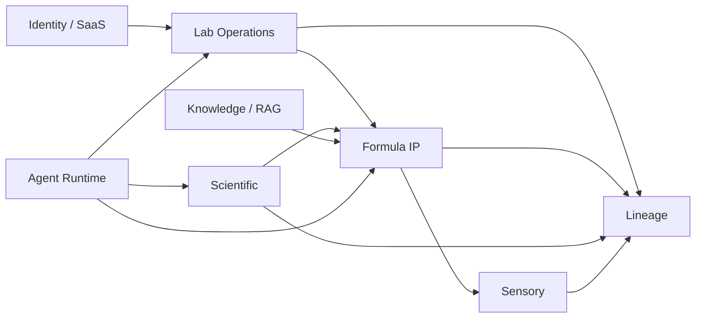

# Data Architecture — OlfactoryOps V2

## 1. Principles

1. One authoritative owner for every aggregate.
2. Tenant-owned data is tenant-scoped at persistence/query boundaries.
3. Immutable history is preferred for operational/scientific evidence.
4. Personal data and tenant business IP are classified separately.
5. Large feature vectors/checkpoints are artifacts, not giant business-row columns.
6. Every external dataset/model has provenance.

## 2. Logical data domains

## 3. Identity / SaaS

### organizations
- id
- slug
- name
- status
- created_at

### users
- id
- primary_email
- display_name
- status
- created_at

### memberships
- organization_id
- user_id
- role_key
- status

### role_policies
- organization_id
- role_key
- permission set
- version
- updated_at

### sessions
- id
- user_id
- tenant context if applicable
- token_verifier_hash
- created_at
- last_seen_at
- idle_expires_at
- absolute_expires_at
- rotated_from
- revoked_at
- revoke_reason
- device metadata

### email_verifications
- user_id
- email
- token_hash
- expires_at
- verified_at
- revoked_at

### workspace_hostnames
- organization_id
- hostname
- type DEFAULT/CUSTOM
- status
- Cloudflare reference
- validation_status
- ssl_status
- activated_at

### workspace_branding
- organization_id
- logo object reference
- display settings

### consents
- user_id
- organization_id nullable by purpose
- purpose
- policy_version
- accepted_at
- withdrawn_at

### notification_preferences / outbox
Separate preferences from delivery jobs.

## 4. Material / molecular identity

### materials
- id
- organization_id nullable only for future curated Global records
- scope TENANT/GLOBAL
- name
- status
- molecular_identity_id
- curated sensory fields
- created_by
- timestamps

### molecular_identities
- id
- canonical_smiles
- inchikey
- structure_hash
- canonicalization_version
- rdkit_version

### material_identifiers
- material_id
- type CAS/INCI/FEMA/EINECS/etc.
- value
- source
- review status

### material_compliance
- material_id
- status
- jurisdiction/category
- structured limit/value where applicable
- source/version
- effective date
- reviewed_by/at

### suppliers
Supplier Profile aggregate.

### supplier_offers
- supplier_id
- material_id
- supplier product/grade
- MOQ
- price/currency
- lead time
- validity/status

## 5. Inventory

### inventory_lots
- organization_id
- material_id
- supplier_id
- supplier_lot
- status
- received/manufactured/expiry dates
- location
- landed unit cost
- quality status

### inventory_movements
Immutable:
- organization_id
- lot_id/material_id
- movement_type
- quantity_delta/unit
- business reference type/id
- actor
- idempotency key
- occurred_at

### reservations
- lot/material
- quantity
- context
- status
- expires_at

Stock projection may be cached but must be reconstructable.

## 6. Procurement

- purchase_requests
- purchase_orders / lines
- shipments
- goods_receipts / lines
- receipt_inspections
- landed_cost_documents
- return_authorizations

Receipt -> Lot retains lineage.

## 7. Formula IP

### formula_projects
### formula_drafts
### formula_versions
Immutable downstream snapshot:
- formula ID/version
- type
- concentrate/final-product context
- approval status
- content hash
- creator/approver
- provenance

### formula_components
- draft/version
- material
- amount
- basis/unit
- order/note

### formula_reviews / approvals

## 8. Design Studio

- design_projects
- brief_versions
- constraint_snapshots
- material_universe_snapshots
- candidate_directions
- candidate_evaluations
- recipient_shares
- feedback
- formula_draft_links

## 9. Trials & Sensory

- trials
- trial_samples
- trial_consumption_links
- sensory_sessions
- sensory_assignments
- sensory_observations
- sensory_decisions
- public_feedback_links if enabled
- sensory_memory_records
- preference_profile_versions

Raw evidence remains historical. Preference profile is derived.

## 10. Production

- production_orders
- production_material_requirements
- production_allocations
- production_weighing_sessions
- production_process_steps
- production_qc_templates/results
- production_yield_records
- bulk_lots
- finished_good_lots

## 11. Commerce

Optional:
- catalogues
- SKUs
- price lists
- customers
- quotes
- sales orders/lines
- reservations
- pick tasks
- packages
- shipments
- fulfillments

## 12. Scientific data

### scientific_feature_sets
Metadata:
- id
- molecule_id
- feature_kind
- feature_schema_version
- component_name/version
- artifact_uri/hash
- created_at

Feature kinds:
- BCFP
- ECFP
- MolFTP
- Osmordred
- GNN
- Transformer
- FusedEmbedding
- OdorEmbedding

### model_registry
- model_id
- name/task
- architecture
- version
- code commit
- feature contract
- checkpoint URI/hash
- status

### training_runs
- model
- configuration
- code version
- environment/container digest
- metrics

### dataset_registry
- dataset_id
- title/source
- license/citation
- version/checksum
- visibility

### dataset_transformations
- dataset
- transform version
- code commit
- input/output hash
- artifact

### predictions
- subject/molecule
- model/version
- input_hash
- output
- uncertainty/calibration/evidence status
- timestamp

## 13. RAG data

- knowledge_sources
- document_versions
- ingestion_jobs
- chunks
- index_versions
- query audit metadata
- citations

Vector store is reconstructable.

## 14. Agent data

Preserve:
- agent_runs
- agent_jobs
- agent_nodes
- agent_messages
- agent_tool_calls
- agent_events
- agent_artifacts
- agent_confirmations

Add:
- workflow_versions
- tool_versions
- provider_usage

Do not store hidden reasoning.

## 15. Lineage

Prefer derived/rebuildable graph projection over duplicate mutable business truth.

Example edge types:
- MATERIAL_HAS_MOLECULE
- MATERIAL_USED_IN_FORMULA
- FORMULA_VERSION_TESTED_BY_TRIAL
- LOT_CONSUMED_IN_TRIAL
- FORMULA_VERSION_USED_IN_BATCH
- RAW_LOT_CONSUMED_BY_BATCH
- BATCH_PRODUCED_FINISHED_LOT
- FINISHED_LOT_RESERVED_BY_ORDER
- MOLECULE_PREDICTED_BY_MODEL
- MODEL_TRAINED_ON_DATASET
- AGENT_RUN_USED_PREDICTION
- AGENT_RUN_USED_RAG_CITATION

## 16. Storage tiers

### PostgreSQL
Primary transactional and metadata store.

### Object storage
- documents
- datasets
- model checkpoints
- scientific feature arrays
- reports/exports

### Vector
- RAG
- molecular embedding
- odor embedding

### Cache
Disposable only.

## 17. Classification

| Class | Examples |
|---|---|
| PUBLIC | public status/docs |
| INTERNAL | non-secret configs |
| TENANT_CONFIDENTIAL | Formula, supplier, material, inventory, orders |
| PERSONAL | user identity, sessions, preferences |
| SENSITIVE_OPERATIONAL | security/audit/cost |
| SCIENTIFIC_IP | model output, feature artifacts, private sensory memory |
| SECRET | API keys, signing keys, raw session tokens — never persist raw |

## 18. Retention

- security/audit according to deployment/legal policy
- expired session metadata minimized according to retention policy
- Trial raw evidence according to tenant policy
- derived memory history retained only under documented policy
- external dataset provenance retained as long as derived model/artifact exists
- object deletion coordinates vector invalidation and lineage
