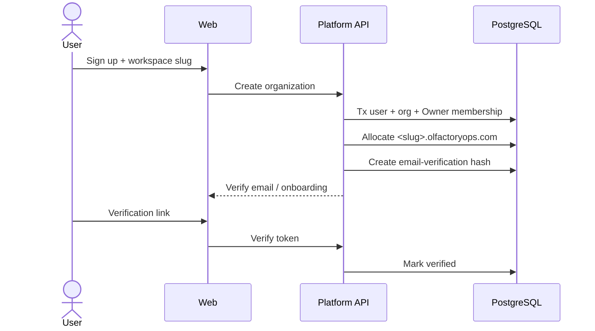
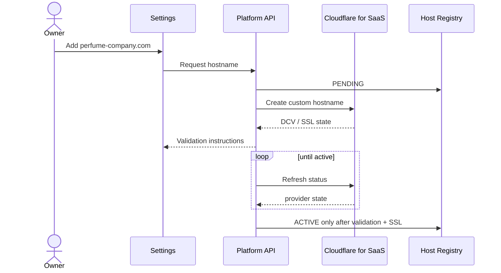
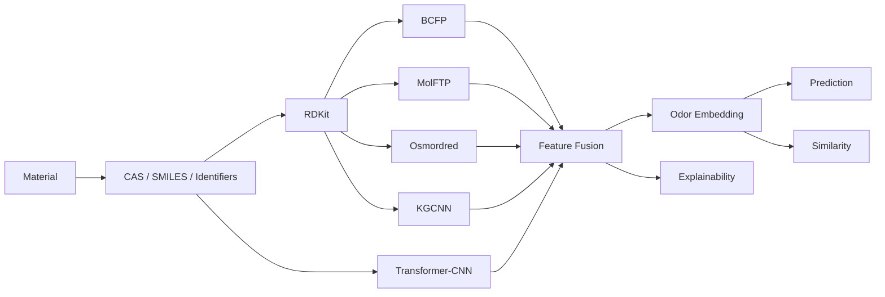
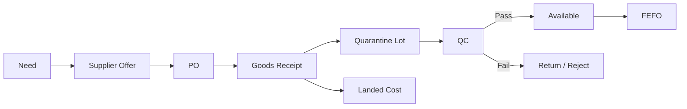
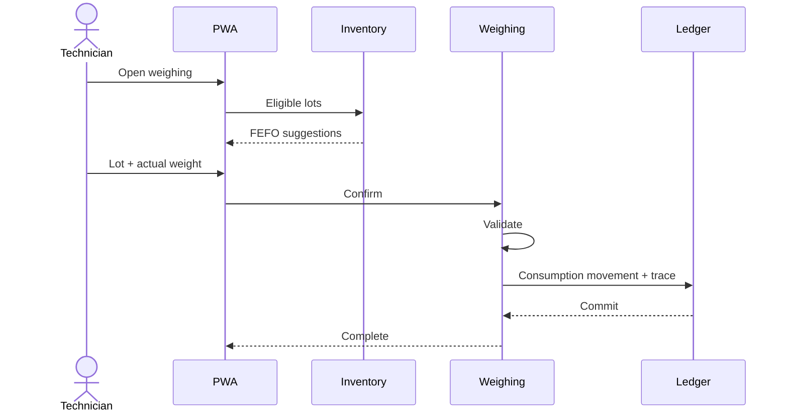
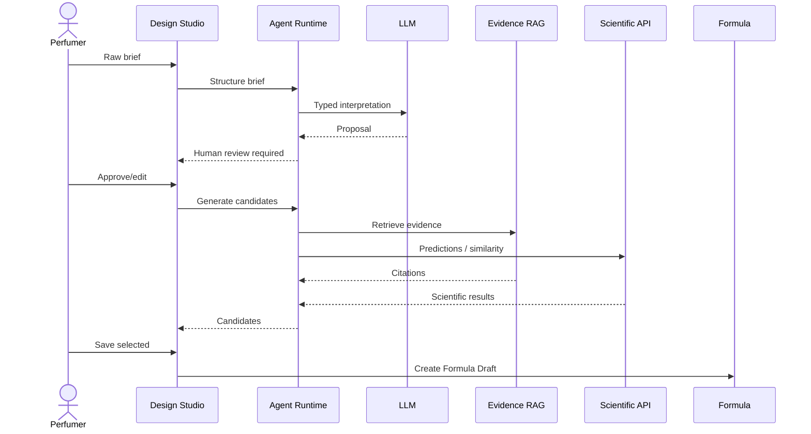
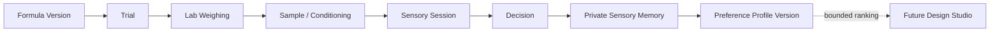
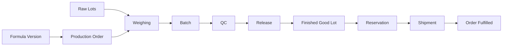
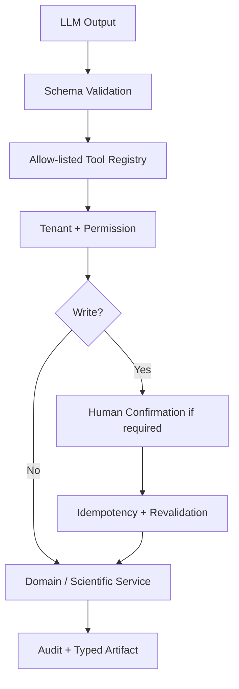
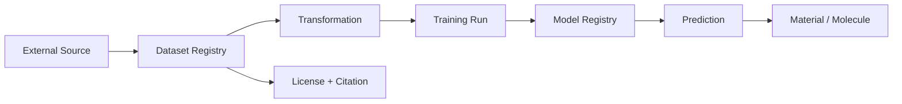

# Mermaid Diagram Pack — OlfactoryOps V2

## Workspace provisioning

## Custom domain

## Material scientific enrichment

## Procurement / inventory

## Lab weighing

## Design Studio

## Trials & sensory learning

## Production trace

## Agent tool security

## Provenance chain

