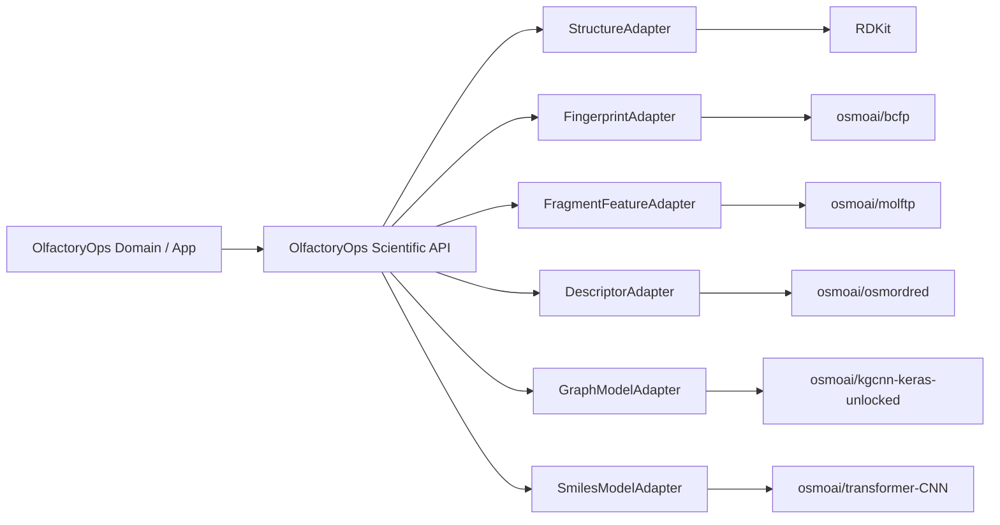

# Osmo Adoption & Provenance Policy
## Mandatory Scientific Foundation for OlfactoryOps V2

## 1. Policy

OlfactoryOps V2 uses selected Osmo open-source repositories as starting scientific components, then extends them through OlfactoryOps-owned adapters and new model/system layers.

This is not a claim of partnership, endorsement or official Osmo compatibility.

## 2. Approved repository set

| Repository | License posture | Integration mode | V2 role |
|---|---|---|---|
| `https://github.com/osmoai/molftp` | BSD-3-Clause | runtime scientific dependency | fragment-target prevalence / explainability |
| `https://github.com/osmoai/bcfp` | BSD-3-Clause | runtime scientific dependency | ECFP/BCFP fingerprints |
| `https://github.com/osmoai/osmordred` | BSD-3-Clause per repository documentation; verify pinned source | runtime scientific dependency | molecular descriptors |
| `https://github.com/osmoai/kgcnn-keras-unlocked` | MIT | research/model dependency | GNN backbones |
| `https://github.com/osmoai/transformer-CNN` | MIT | research/model dependency | SMILES model path |
| `https://github.com/osmoai/publications` | Apache-2.0 code / CC BY 4.0 datasets | research/data | reproduction, benchmark, training/evaluation |
| `https://github.com/osmoai/vexo` | Apache-2.0 | optional/planned | chemistry DataOps |
| `https://github.com/osmoai/genai-toolbox` | Apache-2.0 | infrastructure | MCP/database tooling |
| `https://github.com/osmoai/rdkit-pypi` | packaging repository; track upstream RDKit license independently | build reference | RDKit wheel/build path |

## 3. Explicitly excluded

`https://github.com/osmoai/taxonomy`

Osmo Scent Taxonomy is outside Scope Lock V0.4. This documentation introduces no ODbL database dependency.

Future adoption requires:
- ADR
- license review
- attribution plan
- derivative database analysis
- separate data boundary

## 4. Adapter architecture



Business/domain code depends on OlfactoryOps adapters, never external repository APIs directly.

## 5. Pinning record

Every component records:

```yaml
component:
  name:
  repository:
  license:
  upstream_ref:
  upstream_commit:
  acquired_at:
  adapter_version:
  build_image_digest:
  patches:
  compatibility_tests:
```

## 6. Fork policy

Prefer:
1. pinned upstream dependency
2. thin local adapter
3. upstream contribution for generic fixes

Fork only when needed.

If forked:
- preserve license/notices
- document changes
- track upstream base commit
- maintain patch log
- retain authorship

## 7. Publications datasets

If using Osmo Publications dataset, Dataset Registry stores:
- canonical title
- source/path
- authors/citation
- CC BY 4.0
- version/commit
- checksum
- import time
- transformation chain
- training/evaluation usage

Model Card references exact training datasets.

## 8. Model provenance

```text
Prediction
  -> Model Version
  -> Checkpoint
  -> Training Run
  -> Feature Contract
  -> Scientific Component Versions
  -> Dataset Versions
  -> Source / License / Citation
```

## 9. Runtime provenance

Scientific result contract should identify structure and component versions:

```json
{
  "structure": {
    "canonicalSmiles": "...",
    "structureHash": "...",
    "rdkitVersion": "..."
  },
  "features": [
    {"kind": "BCFP", "componentVersion": "...", "artifactHash": "..."},
    {"kind": "OSMORDRED", "componentVersion": "...", "artifactHash": "..."}
  ],
  "model": {
    "modelId": "...",
    "version": "..."
  }
}
```

## 10. OlfactoryOps extension/IP layer

OlfactoryOps develops:
- adapter contracts
- preprocessing standard
- feature schema
- fusion
- ensemble
- molecular embedding
- odor embedding
- odor prediction
- uncertainty/calibration
- similarity index policy
- explainability composition
- Formula Intelligence
- Trials/Sensory learning
- Private Sensory Memory
- Agent workflows
- Model/Data Registry
- operational lineage
- SaaS/business system

## 11. Commercial release compliance

Before release:
- generate dependency license inventory
- verify pinned component licenses
- retain BSD/MIT/Apache notices
- retain CC BY dataset attribution
- independently audit upstream RDKit license
- scan vendored/transitive dependencies
- update THIRD_PARTY_NOTICES

## 12. Trademark posture

Factual technical notice is acceptable:
- "Uses open-source components released by Osmo Labs under their respective licenses."

Do not market as:
- Powered by Osmo
- Official Osmo integration
- Osmo POM
- Osmo-approved

without separate authorization.
