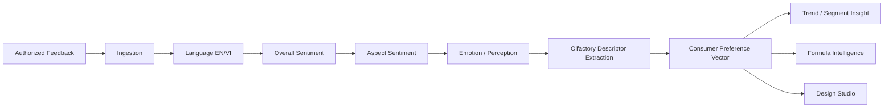

# Sentiment & Consumer Intelligence — OlfactoryOps V2
## Scope Lock V0.4

## 1. Purpose
Convert authorized natural-language consumer/brand feedback into versioned, explainable signals that Formula Intelligence and Design Studio can use as advisory evidence.

## 2. Sources
Potential sources: product reviews, controlled surveys, workshop/customer feedback, brand/client project feedback, and internal evaluation notes explicitly designated for this pipeline. Public availability does not automatically imply model-training rights.

## 3. Pipeline

## 4. Aspect vocabulary
Extensible OlfactoryOps-owned versioned vocabulary; initial examples: opening, heart, drydown, freshness, sweetness, floral, woody, amber, musk, citrus, intensity, projection, longevity, elegance, comfort, naturalness, uniqueness, purchase intent.

## 5. Evidence separation
Sentiment Intelligence is separate from Material Evidence RAG, molecular/odor prediction, structured Trial & Sensory evidence and Private Sensory Memory. Any combined ranking preserves source-specific provenance/confidence.

## 6. Design Studio use
Allowed: brief enrichment, consumer target interpretation, candidate ranking, trade-off visualization, trend comparison. Not allowed: automatic Formula mutation/approval, compliance override, Trial-result override or unsupported causality claims.

## 7. Privacy/governance
Tenant-scoped; raw text and aggregates separately permissioned; PII minimized/pseudonymized; invalidation propagated; no cross-tenant learning by default; no platform training from tenant feedback without explicit approved data-use policy.

## 8. Agent tools
Potential typed tools: `sentiment.analyze`, `sentiment.aspect_trends`, `sentiment.preference_profile`, `sentiment.compare_segments`.
