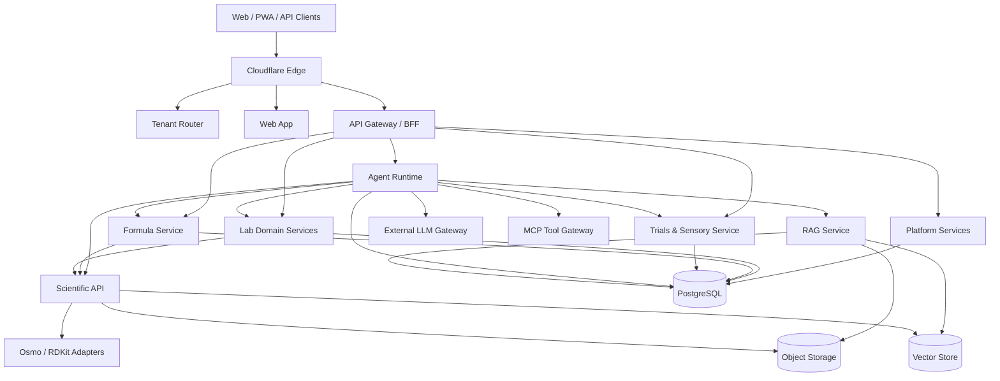

# Service Architecture — OlfactoryOps V2

## 1. Principle

Business workflows, scientific computation and LLM orchestration have different runtime needs and must scale/fail independently.

## 2. Topology



## 3. Cloudflare Edge

Responsibilities:
- DNS/TLS
- WAF/rate limits
- Cloudflare for SaaS
- custom hostname validation integration
- tenant Host routing
- public/static caching
- API ingress

Never cache sensitive authenticated API response.

## 4. Tenant Router

Input: validated Host.

Output: internal organization/workspace context.

Rules:
- only ACTIVE registry hostname
- default `<slug>.olfactoryops.com`
- custom after Cloudflare activation
- never trust arbitrary public organization header/query

## 5. Platform Service

Responsibilities:
- organizations/workspaces
- memberships
- RBAC
- opaque sessions
- email verification
- branding/domains
- billing entitlement
- consent/privacy
- notifications
- audit
- Owner observability

## 6. Lab Domain Service

Can start as modular monolith then split if needed.

Modules:
- Material
- Supplier
- Inventory
- Procurement
- Production
- Commerce/Orders

Business state lives here, not Agent.

## 7. Formula Service

New implementation:
- Draft
- Version
- component
- review
- approval
- design provenance
- formula math/business validation

Scientific inference is called via Scientific API.

## 8. Trials & Sensory Service

Owns:
- Trial lifecycle
- sample/blinding
- sensory sessions
- observations
- decisions
- evidence projection
- Private Sensory Memory

## 9. Scientific API

Stable OlfactoryOps-owned interface.

Capabilities:
- structure normalization
- feature generation
- inference
- embedding
- similarity
- explainability
- model metadata
- async jobs
- health/capability

## 10. Structure Service

Python + RDKit C++ backend.

Responsibilities:
- parse/normalize/canonicalize
- graph preparation
- conformer preparation where required
- structure hash

`osmoai/rdkit-pypi` is build/packaging reference; upstream RDKit license/version is audited separately.

## 11. Feature Service

Adapters:
- BCFP
- MolFTP
- Osmordred

Standard output:

```json
{
  "featureKind": "BCFP",
  "schemaVersion": "1",
  "component": "osmoai/bcfp",
  "componentRef": "pinned-ref",
  "structureHash": "...",
  "artifactUri": "...",
  "artifactHash": "..."
}
```

## 12. Model Service

Paths:
- KGCNN graph models
- Transformer-CNN SMILES
- OlfactoryOps ensemble/fusion

Responsibilities:
- pinned model load
- batch inference
- uncertainty/calibration
- deterministic metadata
- no business DB mutation

## 13. Embedding / Similarity

Supports:
- molecular embedding
- odor embedding
- nearest-neighbor retrieval
- versioned index

Similarity identifies method, model/feature version, metric, index version.

## 14. Explainability

May combine:
- MolFTP fragment contributions
- descriptor importance
- GNN attribution
- ensemble evidence

Output is model explanation/association, not causal proof by default.

## 15. RAG Service

Pipeline:
approval -> extraction -> review -> chunk -> embed -> index -> retrieve -> re-authorize -> cite.

RAG never owns compliance/inventory/Formula authority.

## 16. Agent Runtime

Durable state machine based on proven concepts.

Responsibilities:
- provider invocation
- workflow
- typed tools
- persisted event/replay
- artifact
- confirmation
- retry/cancel
- quotas
- audit

### Provider Gateway
- server-only secret
- structured output
- bounded context
- no hidden reasoning persistence
- sanitize provider errors
- explicit failure/degraded state

## 17. MCP / genai-toolbox

Use `osmoai/genai-toolbox` as infrastructure basis/reference for governed MCP/database tooling.

Preferred:
- read tools
- analytics/exploration
- schema-aware access

Generic DB write tools must not bypass domain services.

## 18. Vexo

`osmoai/vexo` is optional/planned.

Potential:
- chemistry-native BigQuery
- chemistry functions in Sheets
- enterprise research DataOps

Not launch-critical.

## 19. PostgreSQL

Recommended single transactional source of truth.

Requirements:
- migrations
- backups
- tenant-aware indexes
- transactions
- connection pooling/Hyperdrive-equivalent if Workers connect
- no duplicate live writer

## 20. Object storage

Private by default.

Use for documents, model checkpoints, datasets, features, exports.

Object key is not authorization.

## 21. Queue/event system

Use for:
- scientific jobs
- RAG ingestion
- notifications
- document processing
- model batch inference
- long-running agent workflows
- reports

At-least-once consumers are idempotent.

## 22. Observability

Internal:
- traces
- metrics
- logs
- queues
- model latency
- provider/RAG failures
- DB health

Tenant Owner:
- bounded tenant readiness
- AI/RAG status
- recent error/degraded counts
- no secrets/infrastructure internals

Public:
- coarse status only if enabled.

## 23. Failure isolation

### LLM outage
Domain system remains usable; AI displays unavailable/degraded.

### Scientific outage
Operational data remains usable; prediction NOT_AVAILABLE.

### Vector outage
RAG unavailable; no synthetic citation.

### Notification outage
Outbox retries; business commit remains.

### Custom domain issue
Default `<slug>.olfactoryops.com` remains recovery route.

## 24. Environments

- local
- CI
- test/beta
- production

Separate database, object storage, vector index, secrets, domain config and model stage.
