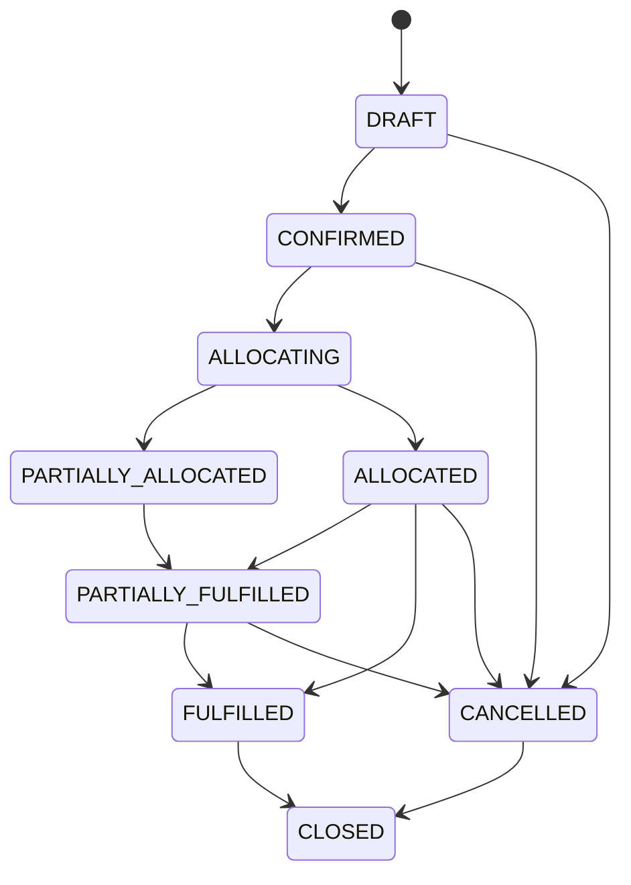
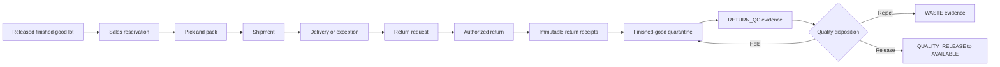

# Phase 10 Commerce Domain Model

## Authority Boundaries

`CommerceService` is the only Phase 10 writer. Browser input supplies no
organization identifier. The platform session resolves the actor and tenant,
then the service runs every aggregate query inside the tenant RLS context.

The service does not write Phase 2 raw-material inventory or procurement
shipment records. It uses the Phase 8 finished-good lot and ledger boundary
for stock already released for sale.

## Commercial Lifecycle

Allocation records move finished-good quantity from `AVAILABLE` to `RESERVED`.
Shipping moves quantity from `RESERVED` out of saleable stock. Cancelling an
order only releases the still-unfulfilled portion. All ledger movements are
idempotency-keyed and append-only.

## Fulfillment And Returns

A return receipt references exactly one return line, one shipped finished-good
lot, and one `RETURN -> QUARANTINE` ledger entry. A receipt cannot be updated
or deleted. The receipt check verifies shipped quantity and all prior returned
quantity for the same sales-order line and lot, so separate return requests
cannot over-receive that lot. A partially received return remains `AUTHORIZED`;
it becomes `INSPECTING` only after every requested line is received.

Quality disposition is a separate immutable `v2_sales_return_dispositions`
decision. It requires one or more active `RETURN_QC` document snapshots.
`HOLD_FOR_QUALITY` retains the existing quarantine balance. `REJECT_TO_WASTE`
writes an append-only `WASTE` movement from `QUARANTINE`. Only an unexpired,
released finished-good lot may receive `RELEASE_TO_AVAILABLE`, which writes a
`QUALITY_RELEASE` movement and additionally requires `production.release`.
Every disposition also requires `documents.view`, so a Quality principal
cannot decide against a document reference that is hidden from that principal.
The return can close only after its Quality disposition; no disposition is an
automatic restock.

## Disclosure Rules

- `commerce.view` and `orders.view` project commercial workflow data.
- `costing.view` and `costing.viewMargin` control cost and margin fields.
- `formula.viewSensitive` controls Formula Version references in SKU snapshots.
- `production.finishedGoods.view` plus `production.documents.view` control lot
  allocations and traceability.
- `documents.view` controls controlled customer-facing document references.

Agent Runtime has no generic Commerce or database tool. The fixed
`commerce.status` adapter requires `orders.view`, reuses `CommerceService`, and
returns at most 20 order identifiers, order numbers, statuses, currencies, and
creation timestamps. It does not return contacts, addresses, price, margin,
allocation, fulfillment, or document data.
