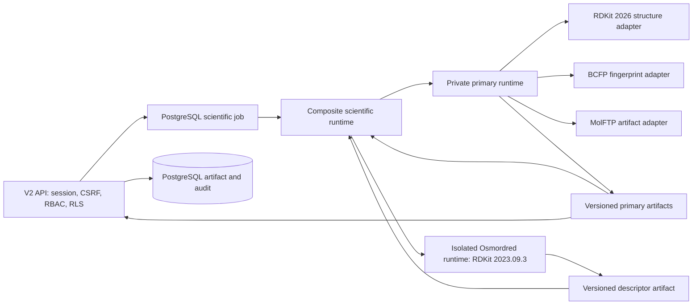

# Phase 3 Scientific Runtime

The V2 API is authoritative for authentication, organization resolution,
permissions, idempotency, jobs, artifacts, and audit. The private Python/C++
runtime receives only a bounded SMILES structure plus selected feature kinds.
It never receives a browser credential, organization ID, inventory, formula,
supplier, or document payload.

The runtime can mark a component `NOT_CONFIGURED` or `NOT_EVALUATED`; it never
creates a `VERIFIED` result from a substitute algorithm. In particular,
MolFTP requires a future dataset registry with aligned, finite labels and a
dataset ID/version/checksum. Public Phase 3 API calls cannot provide this
context, so target-dependent statistics are not generated.

BCFP and MolFTP run in the primary RDKit 2026 process. Osmordred runs in a
separate pinned RDKit 2023.09.3 process because the two native dependency
sets are not ABI-compatible. The composite checks that both canonicalization
paths produced the identical structure hash before returning any combined
result. A disagreement is a normalized fail-closed runtime error.

The future private deployment contract is `SCIENTIFIC_SERVICE_URL` for the
primary runtime and `SCIENTIFIC_OSMORDRED_SERVICE_URL` for the descriptor
runtime. Both require the internal shared-secret header; neither is browser
reachable. No runtime is deployed in Phase 3.

The implementation and test fixtures are under
`services/scientific/runtime/`. The pin record is consumed as provenance for
every returned scientific artifact.
