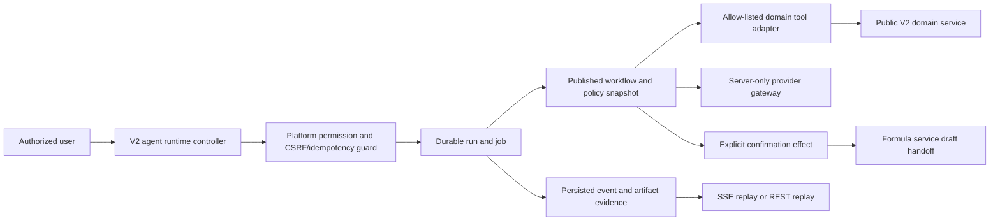

# Phase 9 Governed Agent Runtime Architecture

## Scope

Phase 9 evolves the V2 agent boundary from Phase 6 durable research runs into a governed, versioned runtime. It is additive: migration `0015` preserves the existing Phase 6 run/event replay contract, while `phase6/v1` runs with null Phase 9 version references remain identifiable as legacy runs.

The runtime is tenant-scoped and server-authoritative. It can coordinate approved domain-service projections and one explicitly confirmed Formula Draft handoff; it is not a generic execution environment.

## Runtime Model

Each organization owns independent agent identities and immutable version snapshots:

| Identity | Versioned snapshot | Runtime use |
|---|---|---|
| Agent definition | Instruction reference, input/output schema, model policy | Describes the agent role |
| Workflow | Nodes, edges, tool bindings, input/output schema | Declares the bounded execution graph |
| Tool | Mode, adapter key, schemas, timeout, retry, confirmation policy | Declares an allow-listed capability |
| Policy | Capability allow-list, provider policy, retention/redaction, confirmation defaults | Constrains a run |

An identity can activate only a `PUBLISHED` version. Once created, a version payload is immutable; its allowed lifecycle transition is `DRAFT -> PUBLISHED` or `DRAFT`/`PUBLISHED -> RETIRED`, and a referenced active version cannot be retired. A run stores definition, workflow, and policy version references. Bound tool versions, nodes, messages, confirmations, provider usage, evaluations, lineage, and artifacts are linked execution records.

`v2_agent_runs`, jobs, events, tool calls, artifacts, and confirmations remain the durable execution path. Phase 9 adds run nodes/messages, confirmation intents/effects, provider-usage metadata, evaluations, lineage references, and quota reservations. Tenant associations use composite organization keys; Phase 9 tables have RLS enabled and forced.

## Control Flow

The controller derives tenant/actor context, applies the route-specific permission, and applies CSRF to mutating routes. The durable service enforces idempotency. A registered tool adapter receives actor context, a cancellation signal, and bounded input/output; the target V2 service retains its own authorization, RLS, audit, and aggregate invariants. The agent does not receive a database client.

## HTTP API

The Nest application applies the global `/api/v1` prefix. The run surface is `/api/v1/v2/agent-runs`: list/start, detail/cancel, execute/retry, bounded event replay, SSE stream, evidence, and confirmation preview/decision. The catalog surface is `/api/v1/v2/agent-runtime`: definition list/detail/version, definition policy read/update, evaluations, and observability. The management surface can create a tenant-owned definition identity/version and update an existing tenant-owned policy; it does not expose a generic tool or workflow editor.

## Persisted Replay and Streaming

Persisted events, not SSE, are the source of truth. Run sequences are monotonic and replay is validated, ordered and deduplicated before projection. A sequence gap, malformed persisted event, oversized event or exhausted replay window produces a resynchronization requirement rather than reconstructed state. The client reloads the persisted run projection when it receives `connection.resync_required`.

`GET /api/v1/v2/agent-runs/:id/events` provides bounded replay. `GET /api/v1/v2/agent-runs/:id/stream` accepts `afterSequence` or `Last-Event-ID`, sends a persisted snapshot and events, emits heartbeat transport frames, polls persisted replay, and ends with a resynchronization control event when necessary. Tenant scoping occurs before replay; P9 event payloads are bounded and redacted before persistence rather than rewritten by the streaming controller.

## Provider and Commerce Boundaries

The default provider gateway is server-only and makes no outbound call. It returns `NOT_CONFIGURED`, provider `NONE`, no model, and no structured artifact. The runtime can persist that truthful `NOT_CONFIGURED` provider-usage result, but does not fabricate a completion, token/cost totals, or artifact. The scripted provider is deterministic and test-only, and likewise cannot make outbound requests. A future provider adapter must remain behind the server-only gateway and emit only bounded structured artifacts with response-hash provenance for completed or recorded usage.

The built-in `commerce-assistant` has a read-only `commerce.status` tool, but the Phase 9 domain adapter returns `NOT_CONFIGURED` because Commerce records do not exist before Phase 10. It must not invent order data, use a generic database tool, or treat a Phase 8 shipment record as Commerce state.

## Governed MCP Boundary

No MCP or `genai-toolbox` adapter is registered in this checkpoint. A future integration would need to be a registered, policy-bound typed adapter with bounded payload, permission check, timeout, retry policy, audit event, and durable evidence. There is no generic MCP database write, SQL, shell, URL, HTTP, or unregistered-tool path. Any write remains a named domain operation that re-enters the owning V2 service and its authorization, idempotency, and audit boundary; it cannot bypass those services through an agent or MCP adapter.
